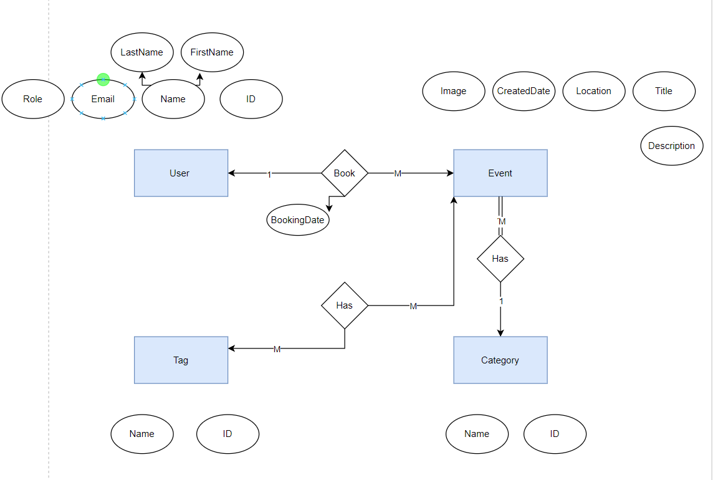

# Event Management System API

A robust ASP.NET Core Web API for managing events, bookings, and user authentication.

## 🚀 Features

- *Authentication & Authorization*
  - JWT-based authentication
  - Role-based authorization (Admin, Client, Organizer)
  - Refresh token mechanism
  - Secure password handling

- *Event Management*
  - Create, read, update, and delete events
  - Category management
  - Tag support for events
  - Image upload via Cloudinary

- *Booking System*
  - Event booking functionality
  - Booking status management
  - User booking history

## 🛠️ Tech Stack

- *Framework*: ASP.NET Core 8.0
- *Database*: Microsoft SQL Server with Entity Framework Core
- *Authentication*: JWT Bearer with Identity
- *Image Storage*: Cloudinary
- *Object Mapping*: Mapster
- *Documentation*: Swagger/OpenAPI
- *Deployment*: Amazon Web Service (AWS)
- *Containers*: Docker


## 📋 Prerequisites

- .NET 8.0 SDK
- Microsoft SQL Server 2022
- Cloudinary account
- Docker
- AWS account
- MonsterASP account

### Database ERD


### Database Schema


## ⚙️ Configuration

### Database Connection
Update appsettings.json with your Micosoft SQl Server connection string:

```json
"ConnectionStrings": {
    "DefaultConnection": "Host=localhost;Port=1433;Database=EventBookingSystem;Username=your_username;Password=your_password"
}


